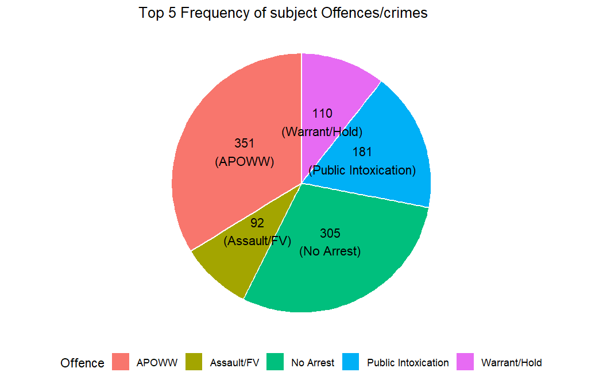
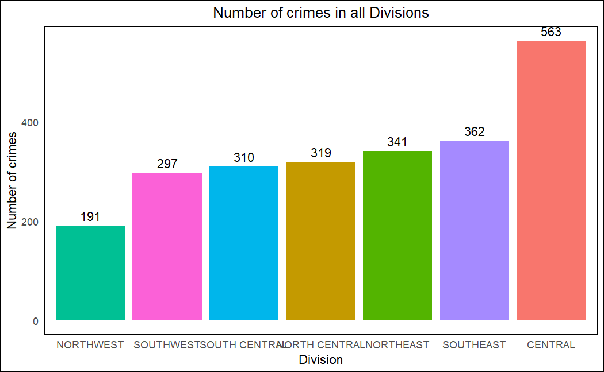
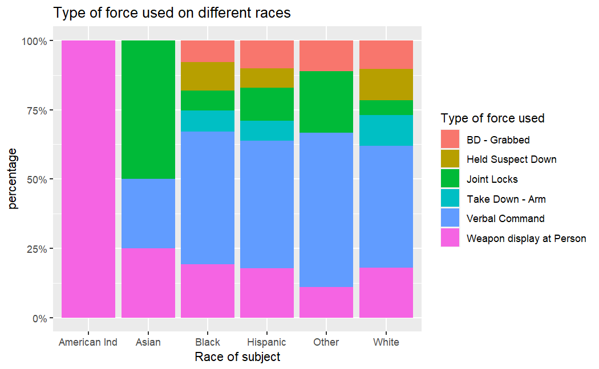
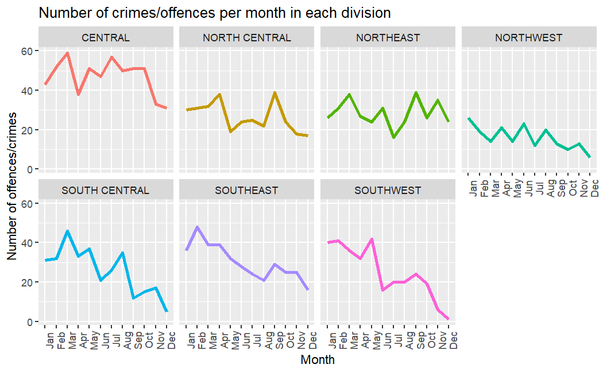
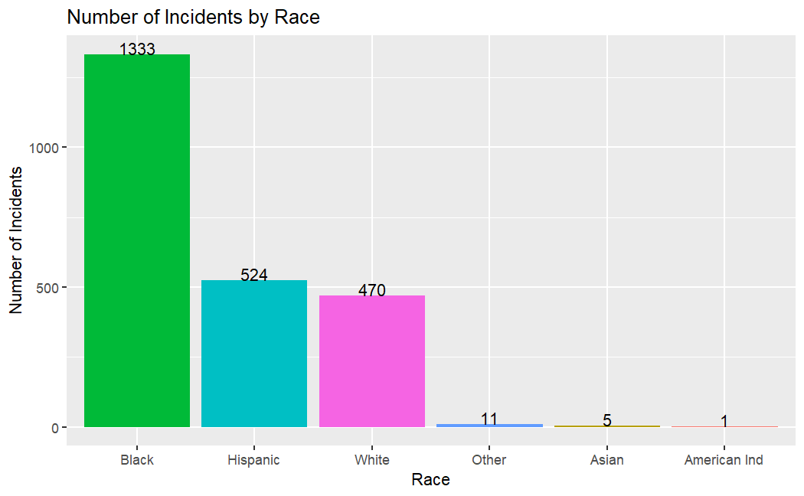
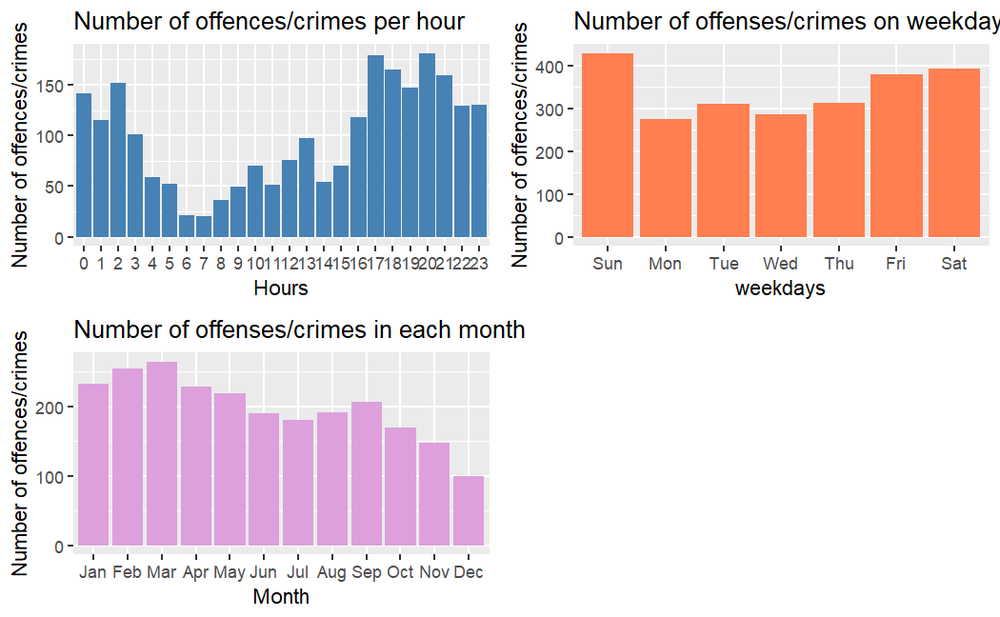
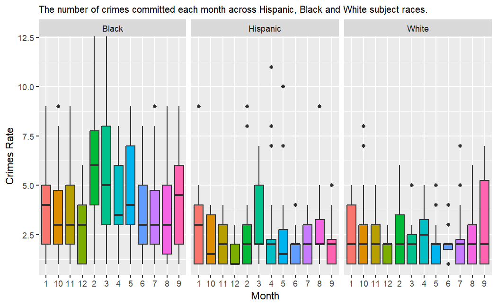
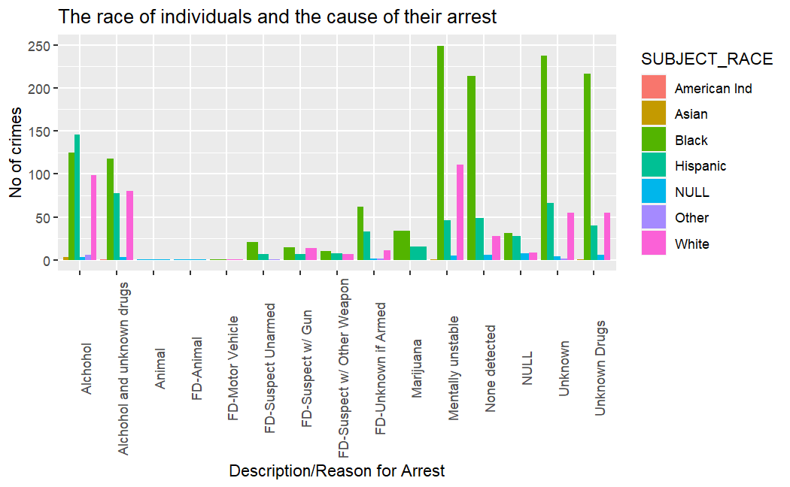

# The-Center-for-Policing-Equity-CPE-Analysis-in-R
Analysis on the center for policing equity (CPE) dataset.

[Dataset](37-00049_UOF-P_2016_prepped.csv)  
[Output report in pdf](Report/CPE_Analysis.pdf)  
[Output report in html](Report/CPE_Analysis.html)  
[Output report in docx](Report/CPE_Analysis.docx)  

## The Center for Policing Equity (CPE)

The Center for Policing Equity (CPE) is a research and policy organization that aims to reduce bias and improve policing practices through data-driven methods. The organization was founded in 2007 by Dr. Phillip Atiba Goff, who is a recognized expert in the field of racial bias in law enforcement.

CPE works with police departments across the United States to collect and analyze data on police interactions with communities of color. The organization's goal is to use this data to identify and address racial disparities in policing, as well as to develop evidence-based solutions for improving police-community relations.

The data has 2383 rows and 47 columns about police work in Dallas, Texas in 2016.

There are four types of data found in data set.

### Incident Information

-   INCIDENT_DATE
-   INCIDENT_TIME
-   UOF_NUMBER
-   INCIDENT_REASON
-   REASON_FOR_FORCE
-   TYPE_OF_FORCE_USED1
-   TYPE_OF_FORCE_USED2
-   TYPE_OF_FORCE_USED3
-   TYPE_OF_FORCE_USED4
-   TYPE_OF_FORCE_USED5
-   TYPE_OF_FORCE_USED6
-   TYPE_OF_FORCE_USED7
-   TYPE_OF_FORCE_USED8
-   TYPE_OF_FORCE_USED9
-   TYPE_OF_FORCE_USED10
-   NUMBER_EC_CYCLES
-   FORCE_EFFECTIVE

### Officer Information

-   OFFICER_ID
-   OFFICER_GENDER
-   OFFICER_RACE
-   OFFICER_HIRE_DATE
-   OFFICER_YEARS_ON_FORCE
-   OFFICER_INJURY
-   OFFICER_INJURY_TYPE
-   OFFICER_HOSPITALIZATION

### Subject Information

-   SUBJECT_ID
-   SUBJECT_RACE
-   SUBJECT_GENDER
-   SUBJECT_INJURY
-   SUBJECT_INJURY_TYPE
-   SUBJECT_WAS_ARRESTED
-   SUBJECT_DESCRIPTION
-   SUBJECT_OFFENSE

### Location Information

-   REPORTING_AREA
-   BEAT
-   SECTOR
-   DIVISION
-   LOCATION_DISTRICT
-   STREET_NUMBER
-   STREET_NAME
-   STREET_DIRECTION
-   STREET_TYPE
-   LOCATION_FULL_STREET_ADDRESS_OR_INTERSECTION
-   LOCATION_CITY
-   LOCATION_STATE
-   LOCATION_LATITUDE
-   LOCATION_LONGITUDE
-   STREET_TYPE

## Analysis (check report for detail)

